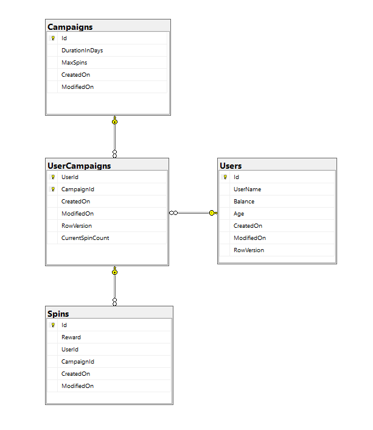

# Free Spins Game API

A **.NET 8 Web API** implementing a simple promotional Free Spins Game.  
Players can spin during a limited-time campaign, with a **maximum number of spins per campaign**.

## Business Rules and Assumptions

- No authentication or authorization is implemented.
- Each campaign has a fixed max spins per player, seeded at creation (random value).
- Players can spin only while the campaign is active.
- Player balance is incremented per spin. Rewards are generated via a `RewardGenerator` in the Domain layer (static, deterministic logic).

## Architecture Highlights

The project follows a **Clean Architecture** approach with 4 core layers:

### 1. Domain Layer

- Contains core entities and simple business rules (only `RewardGenerator`).
- Implements a **ROCO domain model** (not full DDD for simplicity).
- Uses **RowVersion concurrency tokens** on `User` and `UserCampaign` to prevent race conditions.

### 2. Application Layer

- Contains services for business logic, following a CQRS-style pattern with request/response DTOs.
- Uses **Repository pattern** and **lightweight Unit of Work** for clean data access and transactional consistency.
- Handles spin logic, balance updates, and campaign state.

### 3. Infrastructure Layer

- Implements generic repository and lightweight Unit of Work with a global `SaveChanges`.
- Uses SQL Server for database persistence (migrations included) with simple seeding on application startup.

### 4. Presentation Layer

- ASP.NET Core Web API exposing REST endpoints.
- Swagger/OpenAPI integrated for interactive API exploration.

### Additional Highlights

- Global **DateTime service** via interface for clean architecture.
- Custom `OptimisticConcurrencyException` in Unit of Work, including the affected entity.
- Independent **service registration** per layer.
- Generic `Result<T>` wrapper enforces strict success/failure creation via private constructor.
- Thanks custom extension method, `Result<T>` is converted to proper API responses using.

## Database Overview

## Endpoints

- `POST /campaigns`  
  **Request Body:** `durationInDays`  
  **Description:** Create a new campaign

- `GET /campaigns/{id}`  
  **Path Parameter:** `id` – Campaign ID  
  **Description:** Get campaign details

- `POST /spins`  
  **Request Body:** `campaignId`, `userId`  
  **Description:** Perform a spin for a user in a campaign

- `GET /spins`  
  **Query Parameters:** `campaignId`, `userId`  
  **Description:** Get player spin information

- `POST /users`  
  **Request Body:** `userName`, `age`  
  **Description:** Create a new user

## Concurrency Handling

Concurrency is handled with **row versioning (optimistic concurrency)** and **Unit of Work**:

### 1. Spin Count Limit

- Each `UserCampaign` has a `CurrentSpinCount` tracked with a RowVersion.
- Adding a new spin to the `List<Spin>` does not update the table automatically, so `CurrentSpinCount` scalar property is maintained.
- If two threads attempt to spin simultaneously and exceed the max, an `OptimisticConcurrencyException` is thrown.
- API returns **403 Forbidden** in this case.

### 2. Balance Updates

- `User.Balance` is row-versioned to prevent lost updates.
- Concurrent balance updates throw a different concurrency error, suggesting a retry (can be handled with **Polly**).

### 3. Testing Concurrency

- Unit tests simulate **parallel calls** to ensure max spins are not exceeded.
- Debugging confirms concurrency safety when updating the database directly.

**Summary of Failure Modes**

1. Max spins exceeded → `403 Forbidden`
2. Concurrent balance update → Validation error, retry suggested

> Note: For high concurrency or multiple API instances, Redis could be used for atomic operations.

## Testing & Quality

- **Backend code quality** enforced with StyleCop.
- **Testing:** xUnit, Moq, FluentAssertions.
- Unit tests cover:
  - All application layer logic
  - Spin logic concurrency via multiple parallel tasks:
- Manual testing of concurrency issues through database updates during debugging.

## Local Setup Guide

1. **Clone the Repository**
2. **Backend Requirements**
   - .NET 8 SDK
   - SQL Server
3. **EConfiguration**
   - `appsettings.json`: DB connection (uses Windows authentication for simplicity)
4. **Database**
   - EF Core migrations and seeding are applied automatically on startup

## Swagger / OpenAPI

- URL: `/swagger/index.html`
- Provides interactive documentation for all endpoints and request/response models
- Can be used to test spins and query player info directly from the browser

## Possible Improvements

- Add authentication/authorization
- Use Redis for atomic operations under high concurrency
- Implement a more DDD-focused architecture with invariants in the Domain layer
- Use GUIDs as primary keys
- Add global query filters and soft deletes
